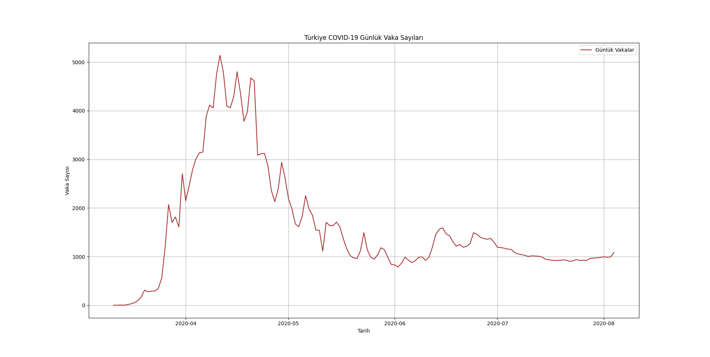
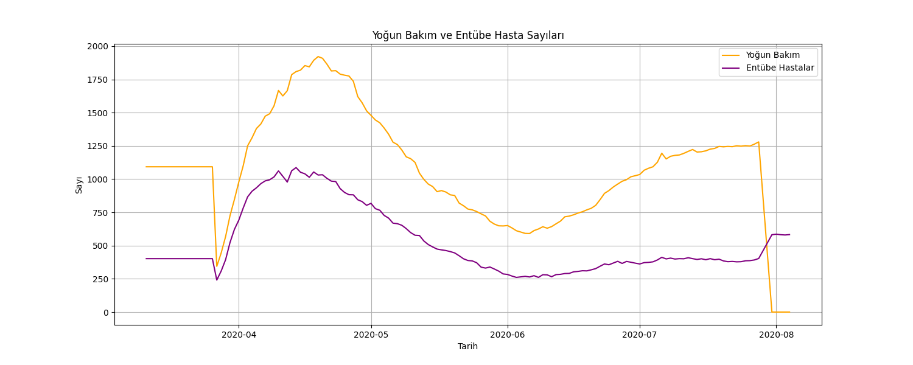
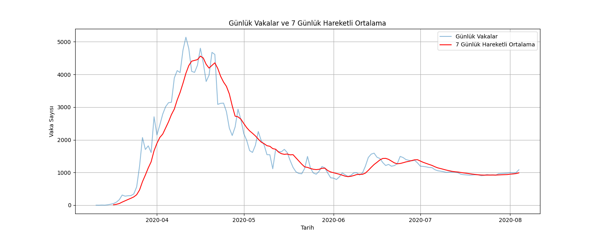
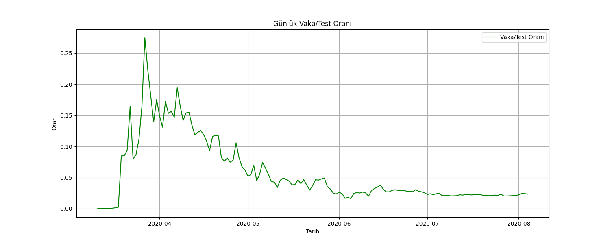
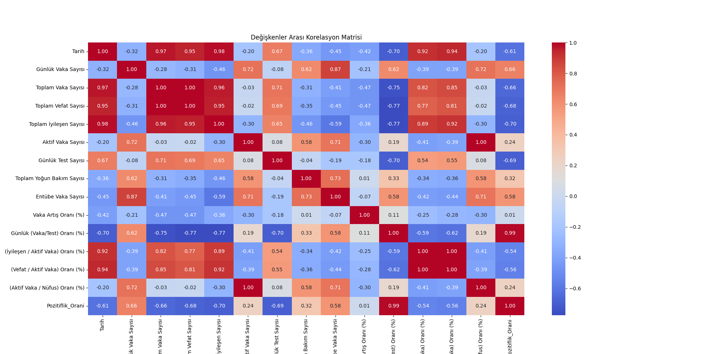

# 📊 Türkiye COVID-19 Veri Analizi Projesi

Bu proje, Türkiye’de COVID-19 pandemisi süresince açıklanan resmi verileri analiz ederek; vaka, ölüm, yoğun bakım, test sayıları gibi temel göstergelerin görselleştirilmesini ve yorumlanmasını amaçlamaktadır. Python programlama dili ve popüler veri bilimi kütüphaneleri kullanılarak yapılmıştır.

---

## 👤 HAZIRLAYAN

**Ad Soyad:** Emre Çağlar
**Bölüm:** Yönetim Bilişim Sistemleri - 2. Sınıf  
**İlgili Alanlar:** Veri Bilimi, Makine Öğrenimi, Python Programlama  
**Topluluk:** Güney Marmara Teknoloji ve İnovasyon Derneği  
**İletişim:** [LinkedIn](https://linkedin.com/in/emre-%C3%A7a%C4%9Flar-9bb493294) | [E-posta](emrecaglar0505@gmail.com)

---

## 🛠 Kullanılan Kütüphaneler

- `Pandas`: Veri işleme ve analiz  
- `NumPy`: Sayısal işlemler  
- `Matplotlib`: Grafik çizimi  
- `Seaborn`: Veri görselleştirme  

---

## 📈 Uygulanan Analizler ve Görselleştirmeler

### 🦠 Günlük Vaka Sayısı

### ⚰️ Toplam Vaka ve Ölüm Sayısı

### 🏥 Yoğun Bakım ve Entübe Hasta Sayıları

### 🔬 Test Pozitiflik Oranı (%)

### 📈 Günlük Vaka ve 7 Günlük Hareketli Ortalama

### 📉 Günlük Vaka/Test Oranı

### 🔍 Değişkenler Arası Korelasyon Matrisi

---

## 📂 Nasıl Kullanılır?

1. Python 3 kurulu olmalıdır.
2. Yandaki komutla gerekli kütüphaneleri yükleyin :  pip install pandas numpy matplotlib seaborn
3- Covid19-Turkey-Turkce.csv dosyasını proje dizinine ekleyin.
4-Python dosyasını çalıştırın:  
python covid19_analiz.py

🚀 Gelecek Geliştirmeler
Aşı ve varyant verileri gibi yeni veri kaynaklarının entegrasyonu
Makine öğrenimi modelleri ile tahminleme çalışmaları
Web arayüzüyle etkileşimli raporlama (Streamlit, Dash gibi)
Bölgesel karşılaştırmalı analizler

💬 Geri Bildirim & Katkı
Projeye dair görüşlerinizi, önerilerinizi veya katkılarınızı benimle paylaşabilirsiniz.
Pull request ve issue açarak katkı sağlamaktan çekinmeyin.
